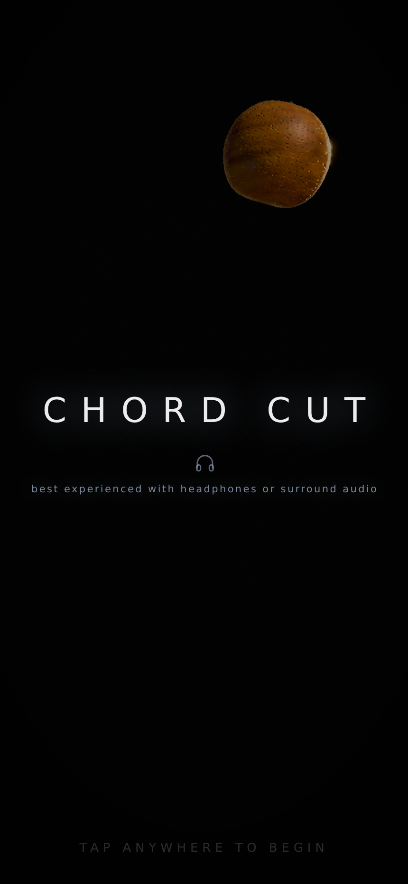

# Chord Cut

### ▶ [Play the demo](https://jhurliman.github.io/zen-slice/) · 🍉 Coming soon to the App Store · ⚖️ GPLv3

**On a phone: open that link in Safari, then Share → Add to Home Screen.** It
launches full-screen with no browser chrome, which is what the framing is
composed for. The web build is the first three levels of the game's
ten-level day arc; the full journey ships as a paid iOS app — buying it is
how you support this work.



A zen fruit-slicing game where **the cut is the note**: every swipe paints onto
a generative music system — piano voiced from a per-level chord palette,
quantized to a beat inferred from your own slicing tempo. Ships as **one
self-contained HTML file** — no network at runtime, no downloaded assets.
Every fruit, material, fluid, light and sound is procedural.

> **It has to be served over https.** `navigator.gpu` is undefined over plain
> `http://` from anything but `localhost`, and this is a `WebGPURenderer`-only
> build with no WebGL2 fallback — so opening `dist/index.html` from a laptop's
> IP address gives you a silently blank canvas. Pages is https; that is the
> reason it is deployed rather than copied.
>
> **WebGPU needs iOS 26+ / Safari 26+.** On an older Safari the canvas stays
> black and the failure is recorded on `window.ZS_BOOT_ERROR` and as
> `data-zs-error` on `<body>`.

- **Renderer:** `WebGPURenderer` + TSL (`three/webgpu`, `three/tsl`), three
  v0.185.1. WebGPU on Safari 26+ / iOS 26+; the WebGL2 backend of the same
  renderer is what the automated probes see (`?capture=1`), since TSL compiles
  to both.
- **Target:** sustained 120 fps on ProMotion iPhone/iPad, never below 60 —
  an 8.3 ms frame for everything. Budgets: ≤120 draw calls, ≤250k triangles,
  ≤2 ms JS p95.
- **Audio:** Web Audio, fully procedural — the piano is *rendered* at unlock
  in an OfflineAudioContext, not loaded. See [docs/MUSIC.md](docs/MUSIC.md).
- **Native:** a Capacitor 8.5 shell for the App Store build lives in `ios/`.
  See [docs/NATIVE.md](docs/NATIVE.md).

## Documentation

| doc | what it covers |
|---|---|
| [docs/MUSIC.md](docs/MUSIC.md) | the generative music architecture — harmony field, conductor, instruments, the laws that keep it consonant |
| [docs/GRAPHICS.md](docs/GRAPHICS.md) | the rendering architecture — stage, procedural fruit, real-geometry cutting, GPU fluid, budgets |
| [docs/NATIVE.md](docs/NATIVE.md) | the iOS wrapper — build loop, Mac-side steps, review posture |
| [HANDOFF.md](HANDOFF.md) | the living engineering log — module map, conventions, per-round design decisions and their reasons |

## Architecture in one paragraph

`src/main.js` boots a fixed-timestep loop over nine modules
(`{init, fixed, frame, quality, resize, dispose}`) that never import each
other — they communicate over an event bus and a shared `ctx` object, with the
domain model frozen in `src/core/contract.js` (Species / Fruit / Solid / Half /
Blade / SliceStroke / JuiceBurst / Director / Score). `SliceStroke` is the
load-bearing type: the cut, the juice, the sound, the slow-mo and the score are
all pure functions of one stroke × one fruit.

```
src/core/contract.js      frozen domain model + event bus
src/core/prefs.js         localStorage persistence (sound/haptics/best)
src/core/native.js        Capacitor shell bootstrap (no-op on the web)
src/render/stage.js       lighting, EXPOSURE CONTRACT, lens, post stack
src/render/compat.js      WebGPU compatibility shims
src/fruit/geometry.js     procedural silhouettes (profile lathe + displacement)
src/fruit/species.js      procedural rind + flesh materials (TSL)
src/slice/cutter.js       mesh split by plane, cap generation, rind collar
src/slice/slicer.js       swipe → SliceStroke → halves
src/juice/fluid.js        GPU fluid: sheet, ligaments, beads, mist
src/input/blade.js        pointer capture, swipe emission, blade ribbon
src/input/haptics.js      slice/harmony/rock pulses (native → vibrate → switch)
src/play/director.js      spawning, ballistics, pacing, the 10-level day arc
src/play/physics.js       Rapier rigid bodies for fruit and halves
src/play/score.js         harmony grouping, beat-synced combo chain
src/audio/                the generative music system (see docs/MUSIC.md)
src/ui/hud.js             score, callouts, hint, settings glyph
src/ui/tuner.js           dev-only ?tune voicing panel
```

## Build

```sh
npm install
node build.mjs        # → dist/index.html (one file, ~4 MB, full game)
DEMO=1 node build.mjs # → the demo-gated build GitHub Pages publishes
```

Yes: a plain `node build.mjs` gives you the complete, ungated game — that is
intended, not an oversight. If you enjoy it, the paid iOS app is the way to
say so.

Published from `main` by
[`.github/workflows/pages.yml`](.github/workflows/pages.yml) on every push.

To try a build on a phone before it is pushed, serve it over `localhost` and
forward the port — `npx serve dist` plus an SSH tunnel, or a tailnet address.
Anything that reaches the phone as a bare `http://192.168.x.x` boots to a blank
canvas (not a secure context, no `navigator.gpu`).

## Test harness

All probes run the real build in headless Chromium on a **virtual clock**
(`ZS.step()` detaches the game from wall time), so software rasterisation
cannot distort what a 120 Hz phone would compute at the same beat. The
harness needs a **full** Chromium (`npx playwright install chromium`) —
the default headless shell has no `navigator.gpu`.

```sh
node tools/audioprobe.mjs     # harmonic laws (pure node) + live-build audio assertions
node tools/drawprobe.mjs      # draw-call / triangle budget on deterministic frames
node tools/fruitviews.mjs     # every species top/side/three-quarter in game lighting
node tools/shoot.mjs          # deterministic screenshot corpus
node tools/soak.mjs           # long-session leak detector (minutes of simulated play)
node tools/perfprofile.mjs    # per-module, per-phase frame-cost attribution
```

Convention: `audioprobe` must be green three consecutive times before any
audio-touching change ships.

## Debug surfaces

| URL flag | what it does |
|---|---|
| `?debug` | HUD strip: fps, tier, chord/bpm/bloom, latency, haptics state; level-jump remote |
| `?tune` | the dev voicing panel — 8 audio macros, A/B, copy-JSON export |
| `?capture=1` | forces WebGL2 + deterministic seams for the probe harness |
| `?nosound` / `?nophys` | disable audio / physics |

`window.ZS` exposes the harness API (`step`, `swipe`, `setTier`, `audio.state()`,
`profile`, …) — every probe drives the game through it.

## License

Chord Cut is free software: the code in this repository is licensed under the
**[GNU GPLv3](LICENSE)**. You can read it, build it, modify it, and
redistribute your modifications under the same license.

Two carve-outs to know about:

- **The name and the artwork are not part of the grant.** "Chord Cut", the
  app icon, and the App Store artwork identify [the author's](https://github.com/jhurliman)
  distribution. Ship a modified build under your own name and icon.
- **The App Store build.** The author, as copyright holder, distributes the
  iOS app under separate terms (the GPL binds licensees, not the owner).
  External contributions are accepted under the grant described in
  [CONTRIBUTING.md](CONTRIBUTING.md), which keeps that possible.

## Contributing

See [CONTRIBUTING.md](CONTRIBUTING.md) — short version: issues and focused
PRs welcome, audio changes must pass `audioprobe` three times running, and
contributions need a one-line license grant so App Store builds stay legal.
